# Deep-Learning-for-Spatio-Temporal-Data-Mining-A-Survey
时空数据挖掘的深度学习

Deep Learning for Spatio-Temporal Data Mining

Paper: [Deep Learning for Spatio-Temporal Data Mining](https://arxiv.org/pdf/1906.04928.pdf)

# 阅读指南

1. 在线观看请使用Chrome浏览器，并安装插件：[MathJax Plugin for Github(需科学上网)](https://chrome.google.com/webstore/detail/mathjax-plugin-for-github/ioemnmodlmafdkllaclgeombjnmnbima)， 插件[Github地址](https://github.com/orsharir/github-mathjax)
2. 或下载内容到本地，使用markdown相关软件打开，如：[Typora](https://typora.io/)
3. **若数学公式显示出现问题大家也可通过jupyter notebook链接查看：[nbviewer](https://nbviewer.jupyter.org/github/Knowledge-Precipitation-Tribe/How-to-Build-a-Graph-Based-Deep-Learning-Architecture-in-Traffic-Domain/blob/master/README.ipynb)**

# Mind map

# [Content](#content)

# [Abstract](#content)

随着全球定位系统（GPS），移动设备和遥感等各种定位技术的迅速发展，时空数据如今已变得越来越可用。从时空数据中挖掘有价值的知识对于许多现实世界的应用至关重要，包括对人类移动性的了解，智能交通，城市规划，公共安全，医疗保健和环境管理。随着时空数据集的数量，数量和分辨率的快速增长，传统的数据挖掘方法，尤其是基于统计的处理此类数据的方法正变得不知所措。近年来，随着深度学习技术的进步，诸如卷积神经网络（CNN）和递归神经网络（RNN）之类的深度学习模型因其在空间和时间上均具有强大的层次特征学习能力而在各种机器学习任务中获得了相当大的成功。领域，并已广泛应用于各种时空数据挖掘（STDM）任务，例如预测学习，表示学习，异常检测和分类。在本文中，我们提供了有关将深度学习技术应用于STDM的最新进展的全面调查。我们首先对时空数据的类型进行分类，然后简要介绍STDM中使用的流行深度学习模型。然后介绍了一个框架，以展示针对STDM的深度学习模型利用的一般流程。接下来，我们根据ST数据的类型，数据挖掘任务和深度学习模型对现有文献进行分类，然后将STDM深度学习在交通，气候科学，人员流动，基于位置的社交网络，犯罪分析和神经科学。最后，我们总结了当前研究的局限性，并指出了未来的研究方向。

# [Introduction](#content)

时空数据挖掘（STDM）在大数据时代变得越来越重要，因为大型时空数据集（如地图，虚拟地球仪，遥感图像，十年一次的人口普查和GPS轨迹）的可用性和重要性不断提高。STDM在各个领域具有广泛的应用，包括环境和气候（例如，风向和降水预测），公共安全（例如，犯罪预测），智能交通（例如，交通流量预测），人员流动（例如，人类轨迹模式挖掘）等。由于多种原因，用于处理交易数据或图形数据的数据挖掘技术在应用于时空数据集时通常表现不佳。首先，ST数据通常嵌入在连续空间中，而经典数据集（例如交易和图表）通常是离散的。其次，ST数据的模式通常同时具有空间和时间特性，这更加复杂，并且传统方法很难捕获数据相关性。最后，传统的基于统计的数据挖掘方法中的常见假设之一是数据样本是独立生成的。但是，当进行时空数据分析时，关于样本独立性的假设通常不成立，因为ST数据倾向于高度自相关。

尽管在过去的几十年中对STDM进行了广泛的研究，但一个普遍的问题是传统方法在很大程度上依赖于要素工程。换句话说，用于STDM的常规机器学习和数据挖掘技术在处理原始格式的自然ST数据的能力方面受到限制。例如，要从fMRI数据分析人的大脑活动，通常需要仔细的特征工程和相当多的领域专业知识来设计特征提取器，以将原始数据（例如，扫描的fMRI图像的像素值）转换为合适的内部表示形式 或特征向量。近年来，随着深度学习的盛行，卷积神经网络（CNN）和递归神经网络（RNN）等各种深度学习模型因其强大的层次特征学习能力而在各种机器学习任务中获得了相当大的成功，并且已经广泛使用 应用广泛，包括计算机视觉，自然语言处理，推荐，时间序列数据预测和STDM。与传统方法相比，STDM深度学习模型的优势如下。

- 自动特征表示学习与需要手工制作特征的传统机器学习方法有很大不同，深度学习模型可以从原始ST数据中自动学习分层特征表示。在STDM中，数据的空间邻近性和长期时间相关性通常很复杂并且难以捕获。通过CNN中的多层卷积操作和RNN的递归结构，可以直接从原始数据中自动有效地学习ST数据中的这种空间邻近性和时间相关性。
- 强大的函数逼近能力从理论上讲，深度学习可以逼近任何复杂的非线性函数，并且只要具有足够的层和神经，就可以拟合任何曲线。深度学习模型通常由多层组成，每一层都可以被认为是具有池化，辍学和激活功能的简单但非线性的模块，因此它将一层的特征表示转换为更高层次和更抽象的表示水平。有了足够多的此类转换，就可以学习非常复杂的功能，以使用更复杂的ST数据执行更困难的STDM任务。

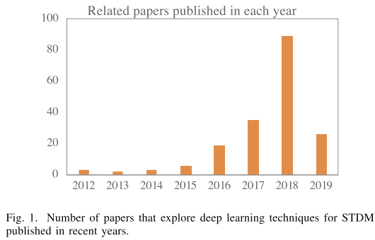

图1显示了每年发表的论文的数量，这些论文探讨了针对各种STDM任务的深度学习技术。可以看到，过去三年中，论文数量呈显着增长趋势。从2012年到2015年，每年仅发表不到10篇相关论文。从2016年开始，这一数量迅速增加，许多研究人员针对不同应用领域中不同类型的ST数据尝试了不同的深度学习模型。2018年发表了约90篇相关论文，数量众多。目前尚无法获得2019年的完整数字，但我们认为增长趋势将在今年以及未来几年保持下去。鉴于问题的丰富性和实际应用的多样性，由于以下原因，迫切需要概述在STDM迅速发展的领域中探索深度学习技术的现有作品。它可以突出显示使用不同的深度学习模型来解决不同应用程序领域的STDM问题的异同。通过使得有可能看到深度学习模型（例如，CNN和RNN）如何针对特定领域（例如，交通流量预测）中的特定问题进行开发，这可以实现跨不同研究领域和应用领域的思想的交叉授粉。运输）对于解决另一个领域的其他问题（例如，犯罪分析中的犯罪预测）可能很有用。

有关STDM的相关调查最近有一些调查从不同的角度回顾了某些情况下有关STDM的文献。[9]和[143]讨论了在诸如遥感，气候科学和社交媒体分析等应用领域的“大数据”时代，STDM算法的计算问题。[87]专注于时空数据的频繁模式挖掘。它指出了从ST数据中发现模式所面临的挑战，并将模式分为三类：单个周期性模式；多轨迹上的成对运动模式和聚集模式。[18]回顾了STDM研究和应用中的最新技术，重点放在时空数据的预测，聚类和可视化的数据挖掘任务上。[130]从计算的角度回顾了STDM，并强调了STDM的统计基础。[112]回顾了轨迹数据挖掘的方法和应用，轨迹数据挖掘是ST数据的一种重要类型。[75]提供了对ST数据聚类的全面调查。[4]讨论了不同类型的ST数据以及在分析每种类型的数据时出现的相关数据挖掘问题。他们将有关STDM的文献分为六大类：聚类，预测学习，变更检测，频繁模式挖掘，异常检测和关系挖掘。但是，所有这些工作都是从传统方法而不是深度学习方法的角度回顾了STDM。[114]和[157]提供了一项调查，该调查特别侧重于利用深度学习模型来分析交通数据以提高交通系统的智能水平。总体上，对于探索STDM的深度学习技术仍然缺乏广泛而系统的调查。

我们的贡献与现有作品相比，本文做出了重要贡献，总结如下：

- 第一次调查：据我们所知，这是第一份回顾最近探索STDM深度学习技术的著作的调查。鉴于近年来对时空数据分析进行深度学习的研究越来越多，我们首先对时空数据类型进行分类，然后介绍在STDM中广泛使用的流行深度学习模型。我们还总结了不同数据类型的数据表示形式，并总结了哪种深度学习模型适合处理ST数据的哪些类型的数据表示形式。
- 通用框架：我们为基于深度学习的STDM提供了一个通用框架，该框架包括以下主要步骤：数据实例构建，数据表示，深度学习模型选择和解决STDM问题。在框架的指导下，给定特定的STDM任务，人们可以更好地使用适当的数据表示形式，并为正在研究的任务选择或设计合适的深度学习模型。
- 全面调查：该调查提供了针对不同STDM问题使用深度学习技术的最新进展的全面概述，这些问题包括预测学习，表示学习，分类，估计和推断，异常检测等。对于每项任务，我们将针对不同类型的ST数据提供具有代表性的作品和模型的详细说明，并进行必要的比较和讨论。我们还将根据应用领域对当前的工作进行分类和总结，包括运输，气候科学，人类流动性，基于位置的社交网络，犯罪分析和神经科学。
- 未来的研究方向：该调查还突出了一些尚待深入研究的未解决问题，并指出了未来可能的研究方向。
- 本调查的组织结构：本调查的其余部分安排如下。第二部分介绍了ST数据的分类，并简要介绍了广泛用于STDM的深度学习模型。第三部分提供了将深度学习用于STDM的通用框架。第四部分概述了深度学习模型解决的各种STDM任务。第五节介绍了各个领域的应用程序库。第六节讨论了现有作品的局限性，并提出了未来的方向。我们最终在第七节中结束了本文。

# [Categorization of Spatio-Temporal Data](#content)

## [Data Types](#content)

ST数据有多种类型，它们在不同的实际应用程序中的数据收集和表示方式不同。不同的应用场景和ST数据类型导致数据挖掘任务和问题表述的类别不同。不同的深度学习模型通常对ST数据的类型有不同的偏好，并且对输入数据格式有不同的要求。例如，CNN模型设计为处理类似图像的数据，而RNN通常用于处理顺序数据。因此，重要的是首先总结ST数据的一般类型并正确表示它们。我们遵循并扩展了[4]中的分类，并将ST数据分为以下类型：事件数据，轨迹数据，点参考数据，栅格数据和视频。

### [Event data](#content)

事件数据包括在地点和时间发生的离散事件（例如，城市中的犯罪事件和交通网络中的交通事故事件）。通常，事件的特征可以是点的位置和时间，分别表示事件发生的位置和时间。例如，犯罪事件可以表征为这样的元组$$(e_i，l_i，t_i)$$，其中$e_i$是犯罪类型，$l_i$是犯罪发生的地点，$t_i$是犯罪发生的时间。图1(a)展示了事件数据。它显示了三种类型的事件，用不同形状的符号表示。ST事件数据在犯罪学（犯罪和相关事件的发生率），流行病学（疾病暴发事件），交通（车祸）和社交网络（社交事件和趋势主题）等现实世界中很常见。

### [Trajectory data](#content)

轨迹表示随时间推移在空间中移动的物体所跟踪的路径。（例如，自行车旅行或出租车旅行的行驶路线）。轨迹数据通常由部署在移动物体上的传感器收集，这些传感器可以随着时间的推移周期性地传输物体的位置，例如出租车上的GPS。图1(b)显示了两个轨迹的图示。每个轨迹通常可以表征为这样的序列${(l_1，t_1)，(l_2，t_2) ...(l_n，t_n)}$，其中$l_i$是位置（例如纬度和经度），$t_i$是当移动物体通过此位置。随着移动应用程序和物联网技术的发展，诸如人类轨迹，城市交通轨迹和基于位置的社交网络等轨迹数据变得无处不在。

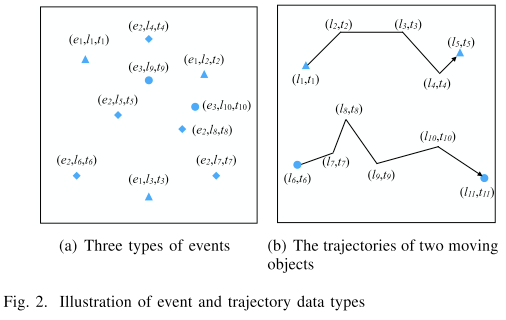

### [Point reference data](#content)

点参考数据包括连续ST的测量值，例如在空间和时间上一组移动参考点上的温度，植被或种群。例如，通常使用漂浮在太空中的气象气球来测量温度和湿度等气象数据，气象气球会连续记录天气观测结果。点参考数据通常可以表示为一组元组，如下$ {{r1，l1，t1），（r2，l2，t2）...（rn，ln，tn）} $。每个元组$(ri，li，ti)$表示在时间$t_i$处ST的$l_i$位置上的传感器$r_i$的测量值。图3示出了在两个时间戳下的连续ST场中的点参考数据（例如海面温度）的示例。它们是由传感器在两个时间戳记上的参考位置（显示为圆圈）测量的。请注意，温度传感器的位置会随时间变化。

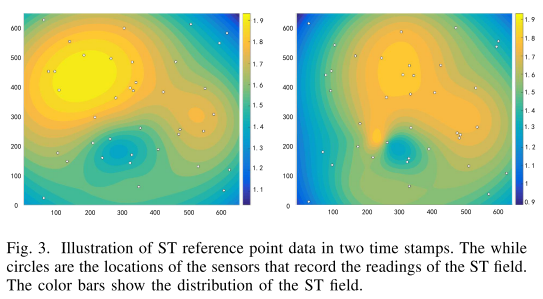

### [Raster data](#content)

栅格数据是连续或离散ST场的测量值，记录在空间中的固定位置和固定的时间点。点参考数据和栅格数据之间的主要区别在于，点参考数据的位置不断变化，而栅格数据的位置固定。测量ST场的位置和时间可以规则或不规则地分布。给定m个固定位置$S = {s_1，s_2，... s_m}$和n个时间戳$T = {t_1，t_2，... t_n}$，栅格数据可以表示为矩阵$R_{m×n}$，其中每个条目$r_{ij}$是时间戳$t_j$处$s_i$处的测量。栅格数据在运输，气候科学和神经科学等实际应用中也很常见。例如，空气质量数据（例如PM2.5）可以由部署在城市固定位置的传感器收集，并且在连续时间段内收集的数据形成空气质量栅格数据。在神经科学中，功能磁共振成像或功能MRI（fMRI）通过检测与血流相关的变化来测量大脑活动。扫描的fMRI信号还形成用于分析大脑活动和识别某些疾病的栅格数据。图4示出了运输网络的交通流栅格数据的示例。每条道路都部署了交通传感器，以收集实时交通流量数据。一整天（24小时）内所有道路传感器的交通流量数据形成一个栅格数据。

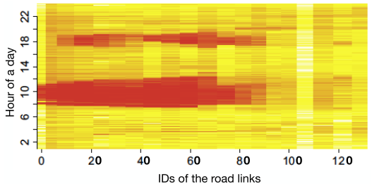

图4.从交通流量传感器收集的栅格数据的图示。x轴是交通网络中道路链接的ID，y轴是一天中的小时。不同的颜色表示由部署在固定位置的道路传感器捕获的道路链路上的不同交通流量。

### [Video](#content)

包含一系列图像的视频也可以视为一种ST数据。在空间域中，相邻像素通常具有相似的RGB值，因此呈现出较高的空间相关性。在时间域中，连续帧的图像通常平滑变化并呈现高时间依赖性。视频通常可以表示为三维张量，一维表示时间t，另两个维表示图像。实际上，如果我们假设在每个像素处都部署了一个“传感器”，并且在每个帧处，“传感器”将收集RGB值，则视频数据也可以视为特殊的栅格数据。基于深度学习的视频数据分析非常热门，近年来发表了大量论文。尽管我们将视频归类为ST数据类型，但我们还是从数据挖掘的角度着眼于审查相关作品，而视频数据分析则属于计算机视觉和模式识别的研究领域。因此，在本次调查中，我们不涵盖视频的ST数据类型。

## [Data Instances and Representations](#content)

数据挖掘算法所操作的基本数据单元称为数据实例。对于经典的数据挖掘设置，通常可以将数据实例表示为一组功能，这些功能带有用于监督学习的标签，而没有用于监督学习的标签。在ST数据挖掘方案中，不同的ST数据类型有不同类型的数据实例。对于不同的数据实例，存在几种类型的数据表示形式，用于表示数据以供深度学习模型进一步挖掘。

### [Data instances](#content)

通常，ST数据可以概括为以下数据实例：点，轨迹，时间序列，空间图和ST栅格，如图5的左侧所示。ST点可以表示为包含空间的元组和时间信息以及观察的一些其他功能，例如犯罪或交通事故的类型。除ST事件外，轨迹和ST点参考也可以形成为点。例如，可以将一条轨迹分解为几个离散的点，以计算在特定时隙中有多少条轨迹经过了特定区域。在某些应用中，除了形成为点和轨迹外，还可以将轨迹形成为时间序列。如果我们确定位置并计算穿过该位置的轨迹数，则它将形成一个时间序列数据。空间图的数据实例包含在每个时间戳处归档的整个ST中所有传感器的数据观测。例如，在时间t处部署在高速公路上的所有环形传感器的交通速度读数形成空间地图数据。ST栅格数据的数据实例包含跨整个位置和时间戳集的测量。也就是说，ST栅格包含一组空间地图。

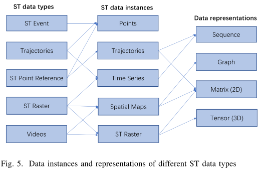

根据不同的应用和分析要求，可以从ST栅格中提取不同的数据实例作为时间序列，空间图或ST栅格本身。首先，对于某些时间序列挖掘任务，我们可以将在ST字段的特定ST网格处的测量视为一个时间序列。其次，对于每个时间戳，可以将ST栅格的测量结果视为空间地图。第三，还可以考虑跨越所有位置和时间戳的所有测量作为一个整体。在这种情况下，ST栅格本身可以是数据实例。

### [Data representations](#content)

对于上述五种类型的ST数据实例，通常使用四种类型的数据表示形式将其表示为各种深度学习模型，序列，图，二维矩阵和3维张量的输入，如右侧部分所示图5。不同的深度学习模型需要不同类型的数据表示作为输入。因此，如何表示ST数据实例取决于正在研究的数据挖掘任务和所选的深度学习模型。

轨迹和时间序列都可以表示为序列。注意，轨迹有时也以矩阵形式表示，其二维是网格ST字段的行和列ID。矩阵的每个输入值表示轨迹是否横越相应的网格区域。这种数据表示通常用于促进CNN模型的利用[67]，[118]，[142]。尽管图也可以表示为矩阵，但在这里我们将图和图像矩阵归为两种不同类型的数据表示。这是因为图节点不像图像矩阵那样遵循欧几里得距离，因此处理图和图像矩阵的方式完全不同。稍后，我们将讨论有关处理两种类型的数据表示方法的更多详细信息。空间图可以表示为图形和矩阵，具体取决于不同的应用。例如，在城市交通流量预测中，城市交通网络的交通数据可以表示为交通流量图[85]，[155]或小区区域级交通流量矩阵[121]，[137]。栅格数据通常表示为2D矩阵或3D张量。对于矩阵而言，这两个维度是位置和时间步长，对于张量而言，这三个维度是行区域单元格id，列区域id和时间戳。与张量相比，矩阵是一种更简单的数据表示格式，但它会丢失位置之间的空间相关信息。两者都广泛用于表示栅格数据。例如，在风能预测中，通常将部署在不同位置的多个风速计的风速时间序列数据合并为一个矩阵，然后输入到CNN或RNN模型中以进行未来风速预测[96]，[200]。在神经科学中，一个人的功能磁共振成像数据是一系列扫描的功能磁共振成像大脑图像，因此可以像视频一样表示为张量。许多工作使用fMRI图像张量作为CNN模型的输入，用于特征学习以检测大脑活动[66]，[76]和诊断疾病[116]，[158]。

## [Preliminary of Deep Learning Models](#content)

在本小节中，我们简要介绍了几种广泛用于STDM的深度学习模型，包括RBM，CNN，GraphCNN，RNN，LSTM，AE / SAE和Seq2Seq。

### [Restricted Boltzmann Machines (RBM)](#content)

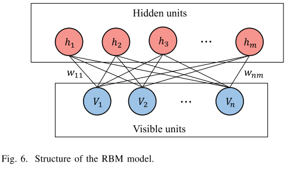

受限玻尔兹曼机是一种两层随机神经网络[53]，可用于降维，分类，特征学习和协作过滤。如图6所示，RBM的第一层称为具有神经元节点${v_1，v_2，... v_n}$的可见层或输入层，第二层称为具有神经元节点${h_1，h_2，... h_m}$。作为完全连接的二部无向图，RBM中的所有节点通过无向权重边${w_{11}，... w_{nm}$跨层相互连接，但是同一层中没有两个节点被链接。RBM的标准类型具有二进制值的节点，也具有权重。RBM尝试学习二进制代码或输入的表示形式，并且根据特定任务，可以以有监督或无监督的方式训练RBM。RBM通常用于学习特征。

### [CNN](#content)

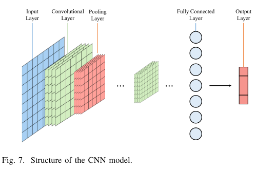

卷积神经网络（CNN）是一类深层的前馈人工神经网络，用于分析视觉图像。典型的CNN模型通常包含以下几层，如图7所示：输入层，卷积层，池化层，完全连接层和输出层。卷积层将通过计算其权重与连接到输入体积的区域之间的标量积来确定其神经元连接到输入局部区域的输出。然后，池化层将简单地沿着给定输入的空间维度执行下采样，以减少参数的数量。全连接层将一层中的每个神经元连接到下一层中的每个神经元，以学习用于分类的最终特征向量。它在原则上与传统的多层感知器神经网络（MLP）相同。与传统的MLP相比，CNN具有以下与众不同的特征，这些特征使它们在视觉问题上实现了很多通用性：3D神经元，局部连接性和共享权重。CNN用于处理图像数据。由于其在空间域中捕获相关性的强大能力，现在已广泛用于挖掘ST数据，尤其是空间地图和ST栅格。

### [GraphCNN](#content)

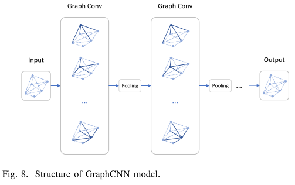

CNN旨在处理可在欧几里得空间中表示为规则网格的图像。但是，有很多应用程序是从非欧氏域生成数据的，例如图结构。最近，对GraphCNN进行了广泛的研究，以将CNN泛化为结构化数据[160]。图8示出了GraphCNN模型的结构示意图。图卷积操作将卷积变换应用于每个节点的邻居，然后进行池化操作。通过堆叠多个图卷积层，每个节点的潜在嵌入可包含来自距离多跳的邻居的更多信息。在生成图中节点的潜在嵌入之后，可以轻松地将潜在嵌入馈送到前馈网络以实现回归目标的节点分类，也可以汇总所有节点嵌入以表示整个图，然后执行图分类和回归。由于它具有捕获节点相关性和节点特征的强大功能，因此现在广泛用于挖掘图结构化的ST数据，例如网络规模的流量数据和大脑网络数据。

### [RNN and LSTM](#content)

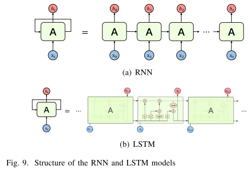

递归神经网络（RNN）是一类人工神经网络，其中节点之间的连接沿序列形成有向图。RNN旨在识别顺序特征并使用模式来预测下一个可能的情况。它们被广泛用于语音识别和自然语言处理的应用中。图9（a）显示了RNN模型的一般结构，其中$X_t$是输入数据，$A$是网络的参数，$h_t$是学习的隐藏状态。可以看到前一个时间步$t-1$的输出（隐藏状态）被输入到下一个时间步$t$的神经。因此，历史信息可以存储并传递给将来。

标准RNN的一个主要问题是，由于梯度消失的问题，它仅具有短期记忆。长短期记忆（LSTM）网络是递归神经网络的扩展，它能够学习输入数据的长期依赖性。由于使用了特殊的存储单元，如图9（b）的中间部分所示，LSTM使RNN能够长时间记住它们的输入。LSTM单元由三个门组成：输入，忘记和输出门。这些门决定是否让新输入进入（输入门），删除信息（因为它不重要）（忘记门）或使其在当前时间步影响输出（输出门）。RNN和LSTM都广泛用于处理序列和时间严重数据，以学习ST数据的时间依赖性。

### [Seq2Seq](#content)

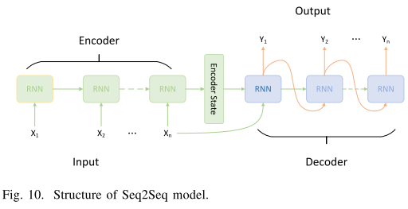

序列到序列（Seq2Seq）模型的目的是将固定长度的输入与固定长度的输出映射，其中输入和输出的长度可能不同[138]。它广泛用于各种NLP任务，例如机器翻译，语音识别和在线聊天机器人。尽管最初提出解决NLP任务的建议，但Seq2Seq是通用框架，可用于任何基于序列的问题。如图10所示，Seq2Seq模型通常由3个部分组成：编码器，中间（编码器）矢量和解码器。由于捕获序列数据之间依存关系的强大能力，Seq2Seq模型被广泛用于ST预测任务中，其中ST数据呈现高时间相关性，例如城市人群流量数据和交通数据。

### [Autoencoder (AE) and Stacked AE](#content)

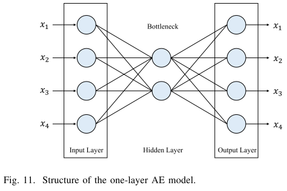

自动编码器是一种人工神经网络，旨在以无监督的方式学习有效的数据编码[53]。如图11所示，它具有编码器功能，可以创建一个包含描述输入的代码的隐藏层（或多层）。然后有一个解码器，它创建来自隐藏层的输入的重构。自动编码器通过学习数据中的相关性，在隐藏层或瓶颈层中创建数据的压缩表示形式，这可以视为降低维度的一种方式。作为一种有效的无监督特征表示学习技术，AE有助于进行各种下游数据挖掘和机器学习任务，例如分类和聚类。堆叠式自动编码器（SAE）是由多层稀疏自动编码器组成的神经网络，其中每层的输出都连接到连续层的输入[7]。

# [Framework](#content)

在本节中，我们将介绍如何使用深度学习模型来解决STDM问题。首先，我们将提供一个描述pipeline的框架，该框架包含ST数据实例构造，ST数据表示，深度学习模型部分和设计，最后解决该问题。接下来，我们将详细介绍这些主要步骤。

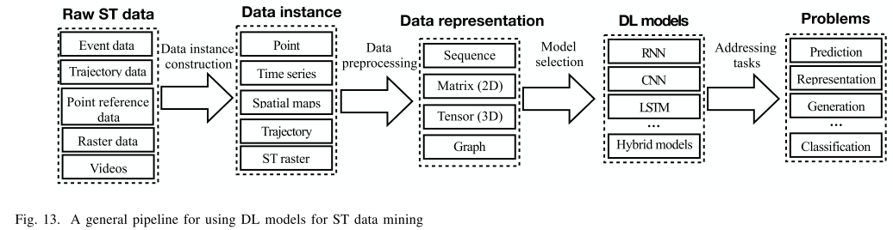

图13显示了使用深度学习模型进行ST数据挖掘的通用pipeline。给定从各种位置传感器收集的原始ST数据，包括事件数据，轨迹数据，点参考数据和栅格数据，首先构建数据实例用于数据存储。如前所述，ST数据实例可以是点，时间序列，空间图，轨迹和ST栅格。为了将深度学习模型应用于各种挖掘任务，ST数据实例需要进一步表示为一种特定的数据格式，以适合深度学习模型。ST数据实例可以表示为序列数据，2D矩阵，3D张量和图。然后对于不同的数据表示形式，不同的深度学习模型适用于处理它们。RNN和LSTM模型擅长处理具有短期或长期时间相关性的序列数据，而CNN模型可有效地捕获图像中的空间相关性（如矩阵）。结合RNN和CNN的混合模型可以捕获ST栅格数据的张量表示的空间和时间相关性。最后，所选的深度学习模型用于解决各种STDM任务，例如预测，分类，表示学习等。

## [ST Data Preprocessing](#content)

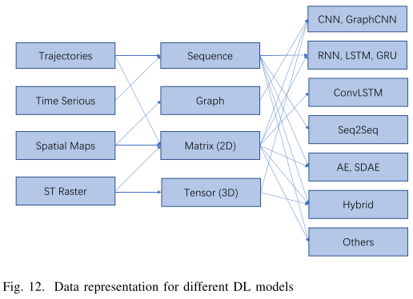

ST数据预处理旨在将ST数据实例表示为深度学习模型可以处理的适当数据表示格式。通常，取决于不同的模型，深度学习模型的输入数据格式可以是向量，矩阵或张量。图12显示了ST数据实例及其对应的数据表示。可以看到，通常一种类型的ST数据实例对应于一种典型的数据表示形式。轨迹和时间序列数据可以自然地表示为序列数据。空间地图数据可以表示为2D矩阵。ST栅格可以表示为2D矩阵或3D张量。

但是，并非总是如此。例如，有时将轨迹数据表示为矩阵，然后应用CNN模型以更好地捕获空间特征[24]，[67]，[103]，[117]，[150]。首先，将测量轨迹的ST字段（例如城市）划分为网格单元区域。然后，可以将ST字段建模为矩阵，每个单元格区域代表一个条目。如果轨迹在单元格区域上移动，则将相应的条目值设置为1；否则，将其设置为1。否则将其设置为0。这样，可以将轨迹数据表示为矩阵，从而可以应用CNN。有时，空间图被表示为图形。例如，通常将以快速方式部署的传感器建模为一个图形，其中节点是传感器，边表示两个相邻传感器之间的路段。在这种情况下，通常使用GraphCNN模型来处理传感器图数据并预测所有节点的未来流量（量，速度等）[22]，[85]。根据数据类型和应用，ST栅格数据可以表示为2D矩阵或3D张量。例如，一系列fMRI脑图像数据可以表示为张量，并输入到用于疾病分类的3D-CNN模型中[78]，[116]，也可以通过提取时间序列相关性将其表示为矩阵。在大脑的成对区域之间进行脑活动分析[48]，[113]。

## [Deep Learning Model Selection & Design](#content)

使用ST数据实例的数据表示，下一步是将它们输入到针对不同STDM任务选择或设计的深度学习模型中。如图12的右侧所示，每种类型的数据表示都有不同的深度学习模型选项。序列数据可用作模型的输入，包括RNN，LSTM，GRU，Seq2Seq，AE，混合模型等。RNN，LSTM和GRU都是适用于预测序列数据的递归神经网络。序列数据也可以通过Seq2Seq模型进行处理。例如，在多步通信量预测中，通常使用由编码器层中的一组LSTM单元和解码器层中的一组LSTM单元组成的Seq2Seq模型来预测接下来几个时隙中的通信量速度或流量同时[89]，[90]。作为特征学习模型，AE或SAE可用于各种数据表示，以学习低维特征编码。序列数据也可以使用AE或SAE编码为低维特征。GraphCNN特别设计用于处理图数据以捕获相邻节点之间的空间相关性。如果输入是单个矩阵，则通常应用CNN模型，如果输入是矩阵序列，RNN模型，ConvLSTM和混合模型，则取决于所研究的问题。如果目标仅用于特征学习，则可以应用AE和SAE模型。对于张量数据，通常由3D-CNN或3D-CNN与RNN模型的组合来处理。

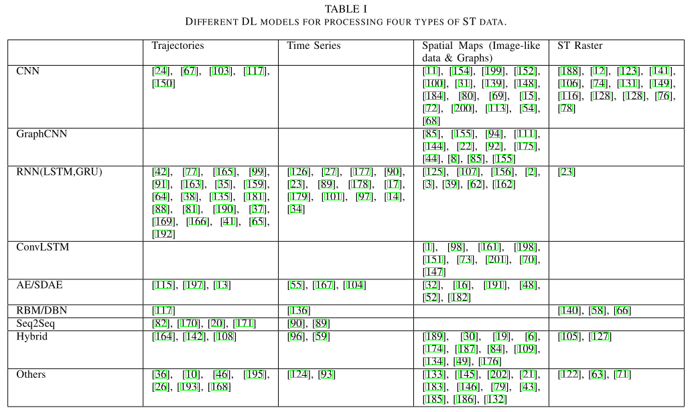

表一总结了使用深度学习模型处理不同类型的ST数据的工作。如表中所示，CNN，RNN及其变体（例如GraphCNN和ConvLSTM）是STDM使用最广泛的两个深度学习模型。CNN模型主要用于处理空间地图和ST栅格。一些作品还使用CNN处理轨迹数据，但目前尚无使用CNN进行时间序列数据学习的作品。GraphCNN模型是专门为处理图形数据而设计的，可以将其分类为空间图。包括LSTM和GRU在内的RNN模型可以广泛应用于处理轨迹，时间序列和空间图序列。ConvLSTM可以被视为结合RNN和CNN的混合模型，通常用于处理空间地图。AE和SDAE主要用于从时间序列，轨迹和空间地图中学习特征。Seq2Seq模型通常设计用于顺序数据，因此仅用于处理时间序列和轨迹。混合模型对于STDM也很常见。例如，可以将CNN和RNN堆叠起来以首先学习空间特征，然后捕获历史ST数据之间的时间相关性。可以将混合模型设计为适合所有四种类型的数据表示形式。其他模型，例如网络嵌入[164]，多层感知器（MLP）[57]，[186]，生成对抗网络（GAN）[49]，[93]，残差网络[78]，[89]，最近的工作中也使用了深度强化学习[50]等。

## [Addressing STDM Problems](#content)

最后，选择或设计的深度学习模型用于解决各种STDM任务，例如分类，预测学习，表示学习和异常检测。请注意，通常如何选择或设计深度学习模型取决于特定的数据挖掘任务和输入数据。但是，为了显示框架的流程，我们首先显示深度学习模型，然后显示数据挖掘任务。在下一部分中，我们将对不同的STDM问题进行分类，并根据问题和ST数据类型详细审查工作。

# [Deep Learning Models for Addressing Different STDM Problems](#content)

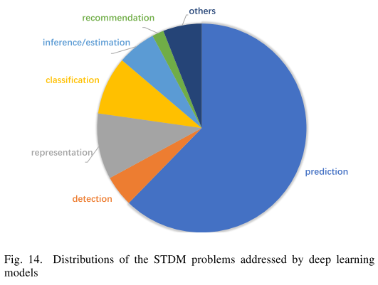

在本节中，我们将对STDM问题进行分类，并介绍为解决这些问题而建议的相应深度学习模型。图14显示了由深度学习模型解决的各种STDM问题的分布情况，包括预测，表示学习，检测，分类，推理/估计，推荐等。可以看到，研究的STDM问题中最大的类别是预测。超过70％的相关论文致力于研究ST数据预测问题。这主要是因为准确的预测很大程度上取决于高质量的特征，而深度学习模型在特征学习中尤其强大。第二大问题类别是表示学习，它旨在以无监督或半监督的方式学习各种ST数据的特征表示。深度学习模型还用于其他STDM任务，包括分类，检测，推理/估计，推荐等。接下来，我们将详细介绍主要的STDM问题，并总结相应的基于深度学习的解决方案。

## [Predictive Learning The](#content)

预测学习的基本目标是根据其历史数据来预测ST数据的未来可能观测值。对于不同的应用程序，输入和输出变量都可以属于不同类型的ST数据实例，从而导致了各种预测性学习问题的表述。在下文中，我们将基于ST数据实例的类型作为模型输入来介绍预测问题。

### [Points](#content)

点通常在时域或空间域中合并以形成时间序列或空间图，例如犯罪[31]，[57]，[145]，[56]，交通事故[201]和社会事件[43]，学习模型可以被应用。[145]修改了ST-ResNet模型，以预测洛杉矶地区的犯罪分布。他们的模型包含两个阶段。首先，他们通过合并在同一时间段和城市区域内发生的所有犯罪事件，将原始犯罪点数据转换为像图像一样的犯罪热图。然后，他们改编了剩余卷积单元的层次结构，以犯罪热图作为输入来训练犯罪预测模型。同样，[57]提出使用GRU模型来预测城市犯罪。[201]使用卷积长短期记忆（ConvLSTM）神经网络模型研究了交通事故预测问题。他们还首先合并了交通事故的点数据，并在时空字段中将交通事故计数建模为3-D张量。张量的每个条目$(i，j，t)$代表时隙t中网格单元$(i，j)$的交通事故计数。历史交通事故张量输入到CovnLSTM中进行预测。[43]提出了一个空间不完整的多任务深度学习框架，以有效地预测发生在不同位置的未来事件的子类型。

### [Time series](#content)

在道路交通预测中，可以将道路或高速公路上的交通流量数据建模为时间序列。最近，许多作品尝试了各种深度学习模型来进行道路交通预测[104]，[136]，[191]。[104]首次利用堆叠式自动编码器从交通流时间序列数据中学习特征，以进行路段级交通流预测。[136]将高速公路上的交通流量数据视为时间序列，并建议使用深度信任网络（DBN）根据先前的交通流量观测来预测未来的交通流量。[126]研究了出租车需求预测问题，并以时间序列对特定区域的出租车需求建模。提出了一个具有全连接层的深度学习模型，以从出租车需求的历史时间序列中学习特征，然后将该特征与其他上下文特征（例如天气和社交媒体文本）集成在一起，以预测未来需求。

RNN和LSTM被广泛用于时间序列ST数据预测。[90]集成了LSTM和序列到序列模型来预测路段的行车速度。除了交通速度信息外，他们的模型还考虑了其他外部特征，包括道路的地理结构，国家庆典等公共社交事件以及在线人群查询旅行信息。通常将诸如风速之类的天气变量建模为时间序列，然后将RNN / LSTM模型应用于未来的天气预报[14]，[17]，[55]，[97]，[124]，[179]。例如，[17]提出了概率风速预测的集成模型。该模型将传统的风速预测模型与小波阈值降噪（WTD）和自适应神经模糊推理系统（ANFIS）与递归神经网络（RNN）集成在一起。在功能磁共振成像数据分析领域，功能磁共振成像时间序列数据通常用于研究功能性大脑网络并诊断疾病。[34]建议使用LSTM模型直接根据静息状态fMRI时间序列对自闭症谱系障碍（ASD）和典型对照进行分类。[59]开发了一种名为DCAE的深度卷积自动编码器模型，用于以无监督的方式从复杂的大规模tfMRI时间序列中学习中级和高级功能。时间序列数据通常不包含空间信息，因此在基于深度学习的预测模型中未明确考虑数据之间的空间相关性。

### [Spatial maps](#content)

空间图通常可以表示为图像状矩阵，因此适合用于CNN模型进行预测学习[69]，[80]，[184]，[200]。[184]提出了一种基于CNN的预测模型，以捕获城市乌鸦流量预测中的空间特征。建立了称为UrbanFlow的实时人群流量预测系统，并以人群流量空间图作为输入。为了预测出行服务的供需，[69]提出了基于六边形的卷积神经网络（H-CNN），其中输入和输出都是大量的局部六边形图。与以前的将城市区域划分为多个正方形格子的研究相反，他们提议将城市区域划分为各种规则的六角形格子，因为六角形分割具有明确的邻域定义，较小的边对面积比和各向同性。一个监视站点的风速数据可以建模为时间序列，而多个监视站点的数据可以表示为空间地图。CNN模型还可用于同时预测多个站点的风速[200]。

给定一系列空间图，要捕获时间和空间相关性，许多工作尝试将CNN与RNN结合在一起进行预测。[161]提出了卷积LSTM（ConvLSTM），并用它来建立降水临近预报问题的端到端可训练模型。这项工作结合了CNN和LSTM单元中的卷积结构，以在序列到序列学习框架下预测时空序列。ConvLSTM是序列到序列的预测模型，其每个层都是一个ConvLSTM单元，在输入到状态和状态到状态的转换中都具有卷积结构。模型的输入和输出都是空间图矩阵。继这项工作之后，许多工作试图将ConvLSTM应用于不同领域的其他空间地图预测任务[1]，[6]，[28]，[70]，[73]，[98]，[151]，[198]。[151]提出了一种用于深度时空预测的跨城市转移学习新方法，称为RegionTrans。RegionTrans包含多个ConvLSTM图层，以捕获隐藏在数据中的时空模式。[73]应用ConvLSTM网络通过使用多通道雷达数据来预测降水。[198]提出了一种端到端的深度神经网络，用于预测按需移动（MOD）服务中的乘客接送需求。采用基于卷积和ConvLSTM单位的编码器-解码器框架来识别复杂的功能，这些功能捕获时空影响以及全市旅客需求的接送互动。将城市单元区域中的乘客需求建模为空间图，并表示为矩阵。同样，[1]提出了一种融合了ConvLSTM层，标准LSTM层和卷积层的FCL-Net模型，用于预测按需乘车服务下的乘客需求。[98]提出了一个统一的神经网络模块，称为注意力人群流动机器（ACFM）。通过使用注意力机制学习时变数据的动态表示，ACFM能够推断人群流动的演变。ACFM由两个渐进式ConvLSTM单元组成，并与一个用于空间权重预测的卷积层相连。

其他一些模型也可以用于预测空间图，例如GraphCNN [8]，[22]，[92]，[144]，ResNet [146]，[183]，[185]和混合方法[49]，[109]，[177]。注意，在本文中，我们认为空间图既包含图像数据也包含图形数据。尽管图也表示为矩阵，但它们需要完全不同的技术，例如GraphCNN或GraphRNN。在道路网络规模的交通量预测中，可以自然地将交通网络建模为图形，然后应用GraphCNN或GraphRNN。[85]提出将交通网络上的交通流建模为有向图上的扩散过程，并引入了扩散卷积递归神经网络（DCRNN）进行交通预测。它在整个道路网络的交通流中都纳入了时空依赖性。具体而言，DCRNN使用图形上的双向随机游走捕获空间相关性，并使用具有计划采样的编码器-解码器体系结构捕获时间相关性。[155]提出了一种新的拓扑框架，称为联动网络，对道路网络进行建模，并提出了交通流的传播模式。基于链接网络模型，设计了一种新颖的在线预测器，称为图递归神经网络（GRNN），以学习图中的传播模式。它根据从整个图表收集的信息同时预测所有路段的交通流量。[144]引入了ST加权图（STWG）来表示稀疏的时空数据。然后，为了对ST数据进行微观预测，他们在STWG上构建了可伸缩的图形化RNN（GSRNN）。

### [Trajectories](#content)

当前，根据轨迹的数据表示，将两种类型的深度学习模型RNN和CNN用于轨迹预测。首先，轨迹可以表示为位置序列。在这种情况下，可以应用RNN和LSTM模型[38]，[64]，[77]，[88]，[135]，[163]，[165]。[163]提出了无碰撞LSTM，它通过添加排斥池层来扩展经典LSTM，以共享相邻行人的隐藏状态以进行人体轨迹预测。无碰撞LSTM可以根据行人过去的位置生成未来序列。[64]研究了城市人口流动预测问题，该问题给出了一个人观察到的流动性的几个步骤，试图预测他/她将在下一城市去哪里。他们提出了带有RNN的深度序列学习模型，以有效预测城市人口流动性。[135]提出了一个名为DeepTransport的模型，用于从一组个人的GPS轨迹中预测诸如步行，乘火车，乘公共汽车等运输方式。四个LSTM层用于构建DeepTransport，以预测用户将来的运输方式。

轨迹也可以表示为矩阵。在这种情况下，可以将CNN模型应用于更好地捕获空间相关性[67]，[103]，[142]。[67]提出了一种基于CNN的方法来表示语义轨迹和预测未来位置。在语义轨迹中，每个访问的位置都与诸如家，工作，商店等的语义相关联。他们将语义轨迹建模为一个矩阵，矩阵的两个维度是语义含义和轨迹ID。矩阵被输入到具有多个卷积层的CNN中，以学习潜在特征，以用于下次访问的语义位置预测。[103]将轨迹建模为二维图像，其中图像的每个像素代表是否在轨迹中访问了相应的位置。然后采用多层卷积神经网络结合多尺度轨迹模式，对滑行轨迹进行目的地预测。将轨迹建模为类似图像的矩阵还用于其他任务，例如异常检测和推断[111]，[150]，稍后将对其进行详细介绍。

### [ST raster](#content)

如前所述，ST栅格数据可以表示为两个维度为位置和时间的矩阵，也可以表示为张量，其三个维度为像元区域ID，像元区域ID和时间。通常对于ST栅格数据预测，将使用2D-CNN（矩阵）和3D-CNN（张量），有时它们也与RNN组合在一起。[188]提出了一种多通道3D立方体连续卷积网络，称为3D-SCN，以从3D雷达数据中即时预报风暴的发生，增长和对流。[121]将连续多个时隙中道路多个位置的交通速度数据建模为ST栅格矩阵，然后将其输入到用于交通流量预测的深度神经网络中。[106]探索了与[121]类似的想法，用于大型运输网络上的交通量预测。[12]提出了一种用于城市范围内车辆流量预测的3D卷积神经网络。他们没有预测道路上的交通，而是尝试预测城市每个小区的车辆流量。因此，他们将连续时间段内的全市车辆流量数据建模为ST栅格，并将其输入到建议的3D-CNN模型中。类似地，[131]将城市中不同时隙中的乘客的流动性事件建模为3D张量，然后使用3D-CNN模型来预测乘客的运输需求。请注意，ST栅格图和空间图之间的主要区别在于，ST栅格图是多个时隙的合并ST场测量值，而空间图是仅一个时隙中的ST场测量值。因此，根据实际应用场景和数据分析的目的，有时可以将相同类型的ST数据表示为空间图和ST栅格。

## [Representation Learning](#content)

表示学习的目的是学习输入数据的抽象和有用表示，以促进下游数据挖掘或机器学习任务，并且表示是由输入数据的多个线性或非线性变换组成的。现有的关于ST数据的表示学习的大多数工作都集中在研究轨迹和空间地图的数据类型上。

### [Trajectories](#content)

轨迹在基于位置的社交网络（LBSN）和各种移动服务中无处不在，并且RNN和CNN模型都被广泛用于学习轨迹表示。[82]针对轨迹相似性计算的基础研究问题，提出了一种基于seq2seq的模型来学习轨迹表示。基于学习的表示的轨迹相似度对于非均匀，低采样率和嘈杂的采样点具有鲁棒性。相似的，[170]，[171]提出将轨迹转换为描述对象运动的特征序列，然后采用序列到序列自动编码器来学习定长的深度表示法进行聚类。基于位置的社交网络（LBSN）数据通常包含两个重要方面，即移动轨迹数据和用户的社交网络。为了对这两个方面进行建模并挖掘它们之间的相关性，[164]提出了一种神经网络模型来共同学习社交网络表示和用户的移动轨迹表示。RNN和GRU模型用于捕获短期或长期水平的移动轨迹中的顺序相关性。[10]提出了一种内容感知的POI嵌入模型CAPE for POI推荐。在CAPE中，对用户签到序列中POI的嵌入向量进行了训练，使其彼此接近。[26]提出了一种名为GeoCNTN的地理卷积神经张量网络，以学习LBSN中位置的嵌入。[41]提出使用RNN和Autoencoder来学习用户签到嵌入和轨迹嵌入，并将这些嵌入用于LBSN中的用户社交圈推理。

### [Spatial maps](#content)

有一些研究如何学习空间地图表示的工作。[21]提出了一种卷积神经网络架构，用于从传感器数据的原始空间图学习时空特征。[153]提出了学习城市社区结构的问题作为空间表征学习任务。提出了一种集体嵌入学习框架，通过统一静态POI数据和动态人类流动图空间地图数据来学习城市社区结构。[182]研究了如何从神经图像数据中学习大脑连通性模式的非线性表示，以加深对神经系统疾病和神经精神疾病的理解。提出了一种称为“多侧视引导自动编码器”（MVAE）的深度学习体系结构，以学习从fMRI和DTI图像获得的输入脑连接组数据的表示形式。

## [Classification](#content)

分类任务主要是在分析fMRI数据中进行的。最近，脑成像技术已成为神经科学领域的热门话题，包括功能性磁共振成像（fMRI），脑电图（EEG）和磁脑电图（MEG）[120]。特别是，fMRI与深度学习方法相结合，已被广泛用于神经科学的各种分类任务中，例如在看单词或图像时进行疾病分类，脑功能网络分类和大脑激活分类[158]。根据不同的分类任务，可以从原始fMRI数据中提取各种类型的ST数据。[34]提出了使用具有长期短期记忆（LSTM）的递归神经网络对自闭症谱系障碍（ASD）和典型对照的分类，这些分类直接来自于不同大脑区域的静止状态fMRI时间序列数据。[48]，[52]，[54]，[71]，[113]，[132]将fMRI数据建模为空间图，然后将它们用作分类模型的输入。代替直接使用每个单独的静止状态fMRI时间序列数据，[48]和[52]基于每对静止状态fMRI时间序列数据之间的Pearson相关系数，计算了全脑功能连接矩阵。然后，可以将相关矩阵视为空间图，并将其输入到DNN模型进行ASD分类。[113]提出了一种用于功能连接组分类的更通用的卷积神经网络架构，称为连接组-卷积神经网络（CCNN）。CCNN能够组合来自各种功能连通性指标的信息，因此可以通过更改使用哪种连通性描述符组合来训练网络，轻松地适应各种基于连接组的分类或回归任务。

一些作品还直接将3D结构MRI脑部扫描图像用作ST栅格数据，然后通常使用3D-CNN模型从ST栅格中学习特征进行分类[63]，[66]，[78]，[116]]，[128]，[194]。[78]提出了两种3D卷积网络架构，用于大脑MRI分类，这是对普通卷积神经网络和残差卷积神经网络的修改。他们的模型可以应用于3D MRI图像，而无需进行中间的手工特征提取。[194]还设计了一个深层3D-CNN框架，用于自动，有效，准确地分类和识别由全脑fMRI信号的稀疏3D表示重建的大量功能性大脑网络。

## [Estimation and Inference](#content)

当前关于ST数据估计和推断的工作主要集中在空间图和轨迹的数据类型上。

### [Spatial maps](#content)

虽然已经建立了监测站来收集污染物统计数据，但由于成本高昂，监测站的数量非常有限。因此，推断细粒度的城市空气质量信息已成为政府和人民的重要问题。[19]基于一些监测站的空气污染物，研究了任何位置的空气质量推断问题。他们提出了一种名为ADAIN的深度神经网络模型，用于对异构数据进行建模并学习复杂的特征相互作用。通常，ADAN结合了两种神经网络：即前馈神经网络（用于建模静态数据）和递归神经网络（用于建模顺序数据），然后是隐藏层以捕获特征交互。[139]研究了深度神经网络在遥感信息降水估计中的应用。堆叠式去噪自动编码器用于自动从红外云图像中提取特征并估算降水量。在智能运输系统中，给定始发地，目的地和出发时间，估计潜在旅程的持续时间是至关重要的任务。为了解决这个问题，[83]提出了一种用于到达时间估计的深层多任务表示学习模型。该模型产生了有意义的表示形式，该表示形式保留了各种旅行属性，同时利用了基础道路网络和时空先验知识。

### [Trajectories](#content)

[147]，[181]尝试根据移动性轨迹数据估算路径的行进时间。[181]提出了一种基于RNN的深度模型DEEPTRAVEL，它可以从历史轨迹中学习以估计出行时间。[147]提出了一种行进时间估算的端到端深度学习框架DeepTTE，该框架直接估算整个路径的行进时间，而不是先估算各个路段或子路径的行进时间，然后对其进行汇总。[111]研究了从轨迹数据推断用户访问某个位置的目的的问题。他们提出了一种图卷积神经网络（GCN），用于根据个人智能手机生成的GPS轨迹数据推断活动类型（即旅行目的）。根据用户的所有活动区域和连接性，基于轨迹数据构造用户的移动性图，然后将时空活动图输入到GCN中以进行活动类型推断。[42]研究了轨迹用户链接（TUL）问题，该问题旨在识别轨迹并将其链接到在LBSN中生成轨迹的用户。提出了一种基于递归神经网络（TUNN）的模型，称为TULER，以通过结合签入轨迹嵌入模型和堆叠LSTM解决TUL问题。确定用户运输方式的分布，例如自行车，火车，步行等是旅行需求分析和交通规划的重要组成部分[24]，[148]。[24]提出了一个CNN模型来仅基于原始GPS轨迹来推断出行车模式，其中这些模式被标记为步行，自行车，公共汽车，驾驶和火车。

## [Anomaly Detection](#content)

异常检测或异常点检测的目的是识别与大多数数据明显不同的，引起怀疑的稀有物品，事件或观察结果。当前关于ST数据的异常检测的工作主要集中在事件和空间图的数据类型上。

### [Events](#content)

[137]试图检测由于事故，体育比赛，恶劣天气等暂时性干扰而引起的非经常性交通拥堵。提出了卷积神经网络（CNN）来识别由事件引起的非经常性交通异常。[189]研究了如何从社交媒体数据中检测交通事故。他们首先彻底调查了北弗吉尼亚州和纽约市1年内超过300万条推文的内容，然后采用了两种深度学习方法：深度信仰网络（DBN）和长期短期记忆（LSTM）来识别交通事故相关推文。[199]提出利用卷积神经网络（CNN）通过使用交通流数据自动检测城市网络中的交通事故。[16]收集了大量的异构数据，包括人员流动数据和交通事故数据，以了解人员流动将如何影响交通事故风险。提出了一种深层的Stack去噪自动编码器模型，以学习人类移动性的分层特征表示，并将这些特征用于交通事故风险等级的有效预测。

### [Spatial maps](#content)

[100]介绍了深度学习技术的首次应用，作为气候极端事件检测（如飓风和热浪）的替代方法。对模型进行了训练，以气候图像数据为输入对热带气旋，天气前线和大气河流进行分类。[72]研究了如何在非常粗糙的气候数据中检测和定位极端气候事件。提出的框架基于两个深层神经网络模型，（1）卷积神经网络（CNN）用于检测和定位极端气候事件，以及（2）像素递归递归超分辨率模型，可从低分辨率气候数据中重建高分辨率气候数据。为了解决有限的标记极端气候事件的问题，[123]提出了一种用于半监督边界框预测的多通道时空CNN架构。在[123]中提出的方法能够利用时间信息和未标记的数据来改善极端天气的定位。

## [Other tasks](#content)

除了上面讨论的问题之外，深度学习模型还应用于其他STDM任务，包括推荐[10]，[81]，[193]，模式挖掘[118]，关系挖掘[197]等。[10] 提出了一种用于POI推荐的内容感知分层POI嵌入模型CAPE。从文本内容中，CAPE不仅捕获了POI的地理影响，还捕获了POI的特征。[193]还提出利用嵌入学习技术来捕获上下文签入信息以进行POI推荐。[118]提出了一种称为DeepSpace的深层结构模型，通过分析人类轨迹的移动数据来挖掘人类的移动模式。[197]研究了轨迹用户链接（TUL）问题，该问题旨在将轨迹链接到通过地理标记的社交媒体数据生成轨迹的用户。提出了一种称为TULVAE（通过变分自动编码器的TUL）的半监督轨迹-用户关系学习框架，以学习具有跨越RNN中隐藏状态的随机潜在变量的神经生成体系中的人员移动性。

## [Fusing Multi-Sourced Data](#content)

除了要研究的ST数据外，通常还有一些其他类型的数据与ST数据高度相关。将此类数据与ST数据融合在一起通常可以提高各种STDM任务的性能。例如，城市交通流量数据可能会受到一些外部因素（例如天气，社交事件和假期）的重大影响。最近的一些工作试图将ST数据和其他类型的数据融合到深度学习架构中，以共同学习特征并捕获它们之间的相关性[16]，[19]，[89]，[174]，[178]，[188]，[201]。通常，在将深度学习模型应用于STDM时，有两种流行的融合多源数据的方法，即原始数据级融合和潜在特征级融合。

### [Raw data-level fusion](#content)

对于原始数据级融合，首先将多源数据进行集成，然后输入到深度学习模型中进行特征学习。[201]通过使用卷积长期短期记忆（ConvLSTM）神经网络模型研究了交通事故预测问题。首先，将整个研究区域划分为网格单元。然后收集许多细粒度的城市和环境特征，例如交通量，道路状况，降雨，温度和卫星图像，并与每个网格单元进行地图匹配。给定事故的数量以及上述每个位置的外部特征作为模型输入，提出了一种Hetero-ConvLSTM模型，用于预测未来时隙中每个网格单元中将发生的事故数量。[19]提出了ADAIN模型，该模型融合了来自监测站的城市空气质量信息和与空气质量密切相关的城市数据，包括POI，道路网络和气象学，以推断城市的细粒度城市空气质量。ADAIN模型的框架如图15所示。首先从多源数据中手动提取特征，这些数据包括道路网络，POI，气象数据和城市空气质量指数数据。然后将所有特征融合在一起，然后馈入FNN和RNN模型以进行特征学习。

### [Latent feature-level fusion](#content)

对于潜在特征级别融合，首先将不同类型的原始特征输入到不同的深度学习模型中，然后使用潜在特征融合组件融合不同类型的潜在特征。[89]提出了一种称为ST-ResNet的基于深度学习的方法，该方法基于残差神经网络框架来共同预测城市每个区域中人群的流入和流出。如图16所示，ST-ResNet处理两种类型的数据，即城市中的ST人群流数据序列和包括天气和假日事件在内的外部特征。设计了两个组件来分别学习外部特征和人群流数据特征的潜在特征，然后使用特征融合功能tanh集成学习的两种类型的潜在特征。[174]提出了一个深度多视图时空网络（DMVST-Net）框架，以结合多视图数据来预测出租车需求。DMVST-Net由三个视图组成：时间视图，空间视图和语义视图。CNN用于从空间视图学习特征，LSTM用于从时间视图学习特征，网络嵌入用于学习区域之间的相关性。最后，使用完全连接的神经网络融合三个视图的所有潜在特征，以预测出租车需求。